# A Journey through Azure Networking

# Updates
* 1/8/2025 - Small fixes to diagrams
* 1/7/2025 - v2 hub and spoke diagrams

## Overview
Organizations often begin the cloud journey with simple requirements. These requirements grow as an organization scales, matures, and migrates critical data and workloads. As more requirements are introduced, the architecture of the an organization's cloud deployment becomes more complex.

This repository contains a collection of core networking patterns starting from basic to advanced. The goal is to assist customers with picking the right pattern for their stage of the journey. Each pattern includes a summary, benefits and considerations, and diagrams providing examples of the patterns and what the route tables could look like.

For the purposes of this repository, north and south traffic is traffic ingressing or egressing to the Internet. East and west is traffic ingressing or egressing between on-premises and Azure or between workloads running in different virtual networks in Azure.

Most third-party firewalls have three interfaces: a public interface (with routes to the Internet), a private interface, and a management interface. These diagrams focus on the routing for the private interface. Routing for the management and public interfaces are best sourced from the 3rd-party documentation. Below is an example of common hub and spoke design.

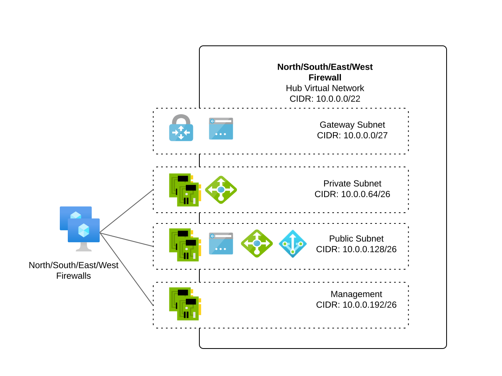

For detail on the traffic flows of the more complex network architectures listed here, reference [this repository](https://github.com/mattfeltonma/azure-networking-patterns).

## Sections
###  General
* [Single Virtual Network and Single Subnet](#single-vnet-and-single-subnet)
* [Single Virtual Network and Multiple Subnets](#single-vnet-and-multiple-subnets)
* [Single Virtual Network and On-Premises Connectivity with S2S VPN](#single-vnet-and-on-premises-connectivity-vpn)
* [Single Virtual Network and On-Premises Connectivity with ExpressRoute](#single-vnet-and-on-premises-connectivity-expressroute)

### Hub and Spoke
* [Hub And Spoke With On-Premises Connectivity Using VPN](#hub-and-spoke-with-on-premises-connectivity-using-vpn)
* [Hub and Spoke With a Flat Network and Forced Tunneling](#hub-and-spoke-with-a-flat-network-and-forced-tunneling)
* [Hub and Spoke With East and West Firewall and Forced Tunneling VPN](#hub-and-spoke-with-east-and-west-firewall-and-forced-tunneling-vpn)
* [Hub and Spoke With East and West Firewall and Forced Tunneling ExpressRoute](#hub-and-spoke-with-east-and-west-firewall-and-forced-tunneling-expressroute)
* [Hub and Spoke With Single Firewall For North South East West](#hub-and-spoke-with-single-firewall-for-north-south-east-west)
* [Hub and Spoke With Dedicated North and South Firewall and Dedicated East and West Firewall](#hub-and-spoke-with-dedicated-north-and-south-firewall-and-dedicated-east-and-west-firewall)
* [Multiple Region Hub And Spoke With Forced Tunneling And No Firewall](#multiple-region-hub-and-spoke-with-forced-tunneling-and-no-firewall)
* [Multiple Region Hub And Spoke With Forced Tunneling And No Firewall With ExpressRoute Bowtie](#multiple-region-hub-and-spoke-with-forced-tunneling-and-no-firewall-with-expressroute-bowtie)
* [Multiple Region Hub And Spoke With Forced Tunneling and East West Firewall And No Global Peering](#multiple-region-hub-and-spoke-with-forced-tunneling-and-east-west-firewall-and-no-global-peering)
* [Multiple Region Hub And Spoke With Forced Tunneling and East West Firewall And With Global Peering](#multiple-region-hub-and-spoke-with-forced-tunneling-and-east-west-firewall-and-with-global-peering)
* [Multiple Region Hub And Spoke With North South East West Firewall And With Global Peering](#multiple-region-hub-and-spoke-with-north-south-east-west-firewall-and-with-global-peering)

### Virtual WAN
* [Single region VWAN hub](#vwan---single-region-vwan-hub)
* [Single region VWAN hub with single branch](#vwan---single-region-vwan-hub-with-single-branch)
* [Single region VWAN Hub with multiple branches](#vwan---single-region-vwan-hub-with-multiple-branches)
* [Multiple region VWAN Hubs with multiple branches connected to a single hub](#vwan---multiple-region-vwan-hubs-with-multiple-branches-connected-to-a-single-hub)
* [Multiple region VWAN Hubs with multiple branches connected to multiple hubs](#vwan---multiple-region-vwan-hubs-with-multiple-branches-connected-to-multiple-hubs)
* [Multiple region VWAN Hubs with multiple branches connected to multiple hubs for redundancy](#vwan---multiple-region-vwan-hubs-with-multiple-branches-connected-to-multiple-hubs-for-redundancy)
* [Multiple Region VWAN Secure Hubs with Multiple Branches Connected to Multiple Hubs for Redundancy and North and South Firewall Using Routing Intent](#vwan---multiple-region-vwan-secure-hubs-with-multiple-branches-connected-to-multiple-hubs-for-redundancy-and-north-and-south-firewall-using-routing-intent)
* [Multiple Region VWAN Secure Hubs with Multiple Branches Connected to Multiple Hubs for Redundancy and North South East West Firewall Using Routing Intent](#vwan---multiple-region-vwan-secure-hubs-with-multiple-branches-connected-to-multiple-hubs-for-redundancy-and-north-south-east-west-firewall-using-routing-intent)
* [Multiple Region VWAN Hubs With Multiple Branches Connected to Multiple Hubs For Redundancy and North and South Third Party Firewall](#vwan---multiple-region-vwan-hubs-with-multiple-branches-connected-to-multiple-hubs-for-redundancy-and-north-and-south-third-party-firewall)
* [Multiple Region VWAN Hubs with Multiple Branches Connected to Multiple Hubs for Redundancy and North South East West Third party firewall](#vwan---multiple-region-vwan-hubs-with-multiple-branches-connected-to-multiple-hubs-for-redundancy-and-north-south-east-west-third-party-firewall)

### Additional Resources
* [Wonderful video by Adam Stuart on what the route tables look like with ExpressRoute](https://www.youtube.com/watch?v=Pg7dGDwNNPU)
* [Excellent write-up by Heather Sze on Azure Route Server pattern for cross-region connectivity](https://github.com/hsze/MultiRegion-HubSpoke-ERBowTie-ARS)

## Patterns
### Single VNet And Single Subnet
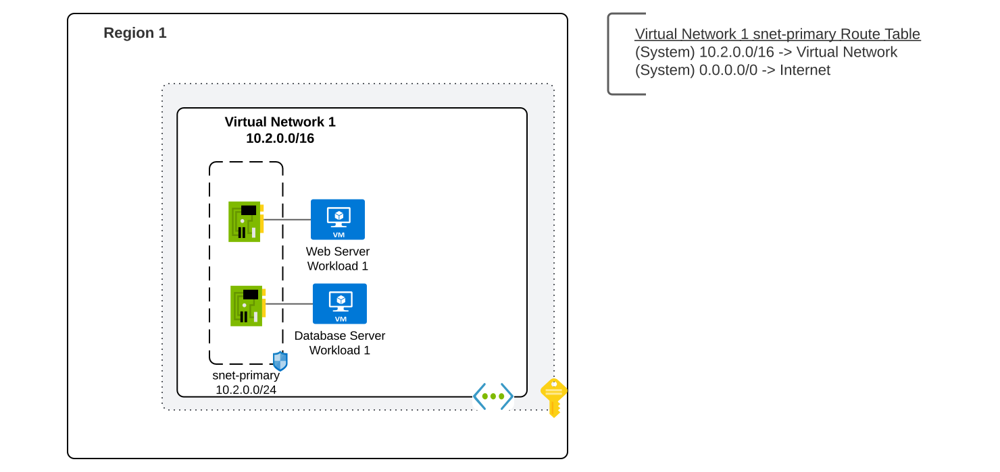

In this pattern there is a single virtual network with a single subnet all resources are placed in. 

*Benefits*
* All virtual machines in the same virtual network can communicate with each other using default system routes.
* Virtual machine communication within the subnet can be mediated a network security group.

*Considerations*
* Scaling this pattern can be a significant problem because subnets cannot be resized once network interfaces are associated with them.
* Managing network security groups for intra-subnet traffic can be prone to misconfigurations.
* All resources have direct access to the Internet through the default system route.
* This pattern does not allow for connectivity back on-premises.

### Single VNet And Multiple Subnets
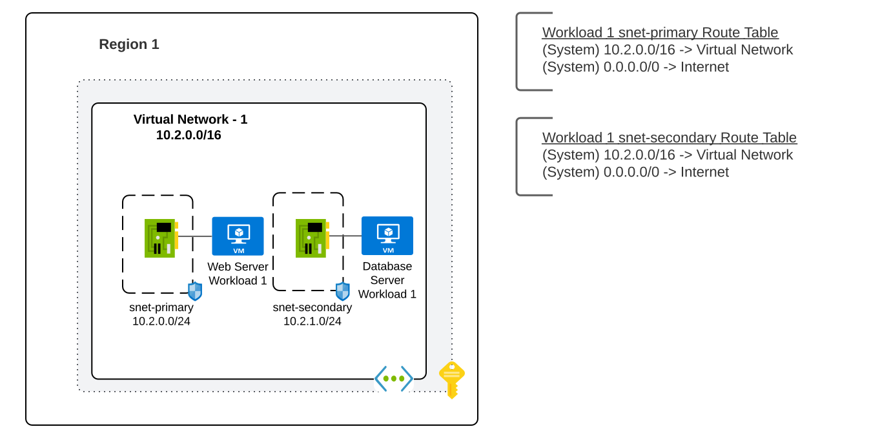

In this pattern there is a single virtual network with multiple subnets.

This is a common pattern for proof-of-concepts for a single workload where there is no requirement for on-premises connectivity.

*Benefits*
* All virtual machines in the same virtual network can communicate with each other using default system routes.
* Virtual machine communication between subnets can be mediated with network security groups.

*Considerations*
* All resources have direct access to the Internet through the default system route.
* This pattern does not allow for connectivity back on-premises.

### Single VNet And On-Premises Connectivity VPN
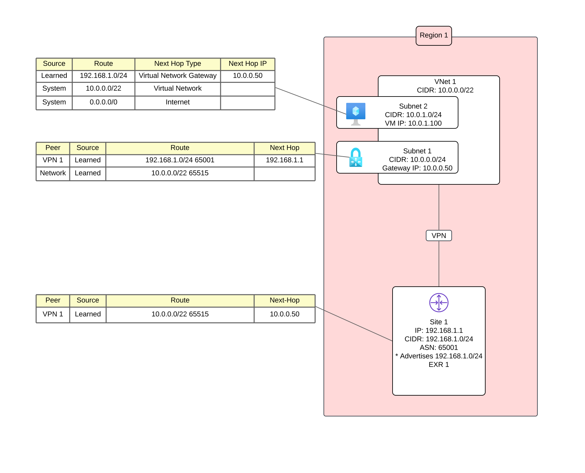

In this pattern there is a single virtual network with multiple subnets and the workloads require on-premises connectivity. A site-to-site VPN is used to establish connectivity between Azure and on-premises.

This is a common pattern for proof-of-concepts for a single workload where on-premises connectivity is required.

*Benefits*
* On-premises connectivity is provided by a Virtual Network Gateway configured with a site-to-site VPN and BGP for exchanging of routes between Azure and on-premises.
* All virtual machines in the same virtual network can communicate with each other using default system routes.
* Virtual machine communication between subnets can be mediated with network security groups.

*Considerations*
* Site-to-Site VPN is [limited to maximum 2.3Gbps](https://learn.microsoft.com/en-us/azure/vpn-gateway/about-gateway-skus#performance) per tunnel which can be prohibitive when moving large amounts of data. 
* The workload and on-premises connectivity resources must be within the same subscription.
* All resources have direct access to the Internet through the default system route.

### Single VNet And On-Premises Connectivity ExpressRoute
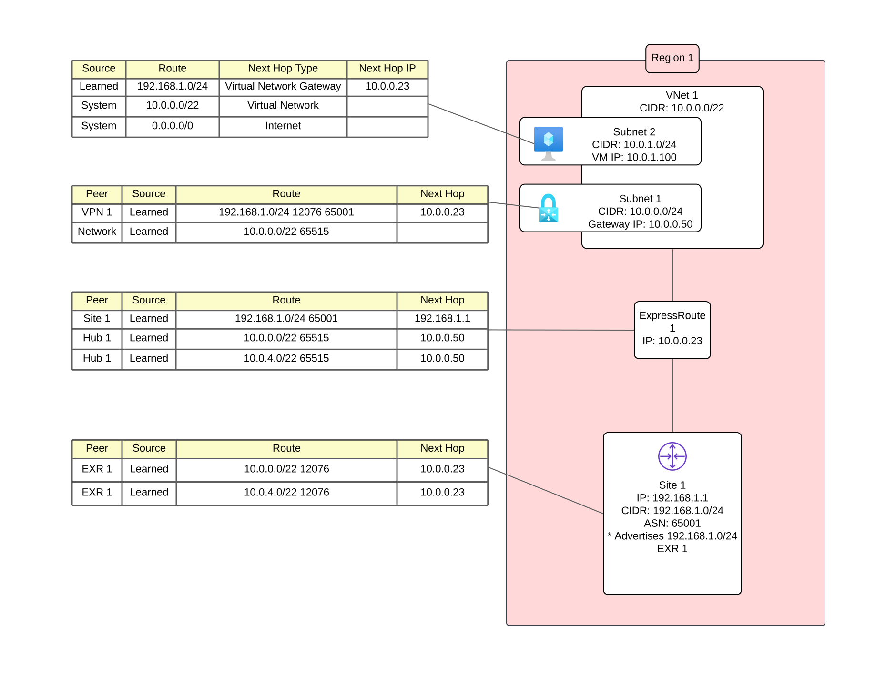

In this pattern there is a single virtual network with multiple subnets and the workloads require on-premises connectivity. A site-to-site VPN is used to establish connectivity between Azure and on-premises.

This is a common pattern for proof-of-concepts for a single workload where on-premises connectivity is required and the customer has an existing ExpressRoute connection.

*Benefits*
* On-premises connectivity is provided by a ExpressRoute connection and routes are exchanged between Azure and on-premises with BGP.
* All virtual machines in the same virtual network can communicate with each other using default system routes.
* Virtual machine communication between subnets can be mediated with network security groups.

*Considerations*
* If the customer does not already have an ExpressRoute deployed, the time and cost to bring up an ExpressRoute may be prohibitive for a proof-of-concept .
* The workload and on-premises connectivity resources must be within the same subscription.
* All resources have direct access to the Internet through the default system route.

### Peered VNets And On-Premises Connectivity With Multiple Workloads
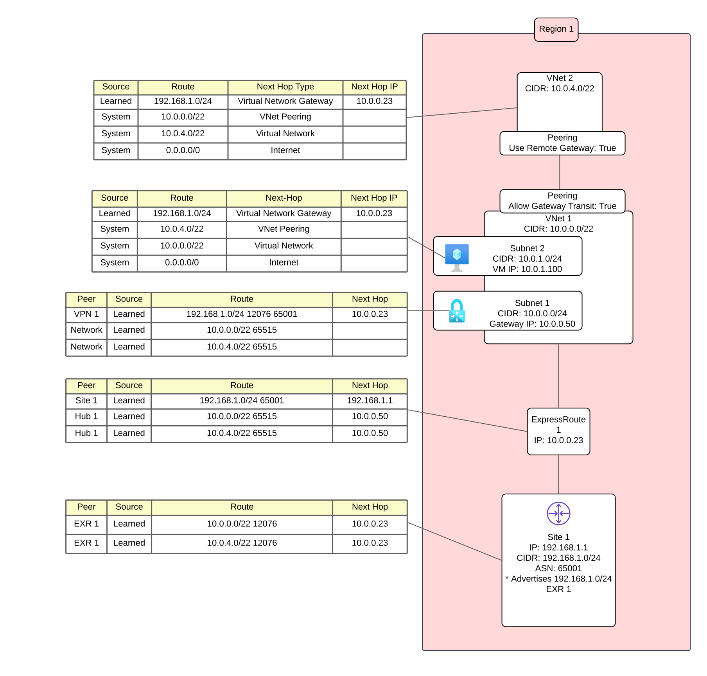

In this pattern each workload is its own virtual network and requires on-premises connectivity. 

*Benefits*
* On-premises connectivity is provided by a ExpressRoute connection and routes are exchanged between Azure and on-premises with BGP.
* On-premises connectivity for the peered virtual network is provided by [gateway transit](https://learn.microsoft.com/en-us/azure/virtual-network/virtual-network-peering-overview).
* Workload resources can be placed in separate subscriptions which creates a smaller blast radius.
* All virtual machines in the separate peered virtual networks can communicate with each other using default system routes.
* Virtual machine communication between subnets in the separate peered virtual networks can be mediated with network security groups.
* All virtual machines in the same virtual network can communicate with each other using default system routes.
* Virtual machine communication between subnets in the same virtual network can be mediated with network security groups.

*Considerations*
* One workload must be within the same subscription as the virtual network gateway.
* All resources have direct access to the Internet through the default system route.

### Hub And Spoke With On-Premises Connectivity Using VPN
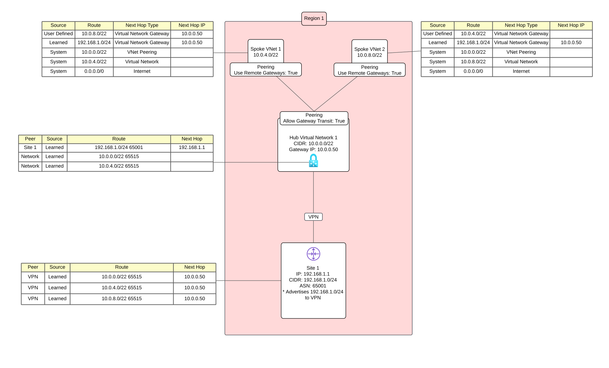

In this pattern there is a dedicated virtual network used for on-premises connectivity which is shared with each workload. Each workload has its own dedicated virtual network. There is a requirement that the spoke virtual networks communicate.

This is a common pattern for organizations new to Azure and are performing a limited proof-of-concept where inspection of Internet egress is not a concern.

User-defined routes are used in this pattern to point to the virtual network gateway in order to facilitate routing between spokes. Note that only a VPN Gateway can function in this manner. ExpressRoute does not support this pattern and cannot be set as a destination in a user-defined route.

*Benefits*
* Workload virtual networks can communicate with each other without the traffic leaving Azure using the VPN Gateway as a transitive router.
* Workloads have dedicated subscriptions containing their virtual network and workload resources creating separate blast radiuses.
* The on-premises connectivity resources are in a dedicated subscription creating a separate blast radius.
* On-premises connectivity is provided by a VPN Gateway and routes are exchanged between Azure and on-premises with BGP.
* On-premises connectivity for the peered virtual network is provided by [gateway transit](https://learn.microsoft.com/en-us/azure/virtual-network/virtual-network-peering-overview).
* Virtual machine communication between subnets in the separate peered virtual networks can be mediated with network security groups.
* All virtual machines in the same virtual network can communicate with each other using default system routes.
* Virtual machine communication between subnets in the same virtual network can be mediated with network security groups.

*Considerations*
* This pattern creates static route overhead and would not be supported with the same design and traffic flow when using an ExpressRoute Gateway.
* Additional costs and latency will be incurred for egressing Internet-bound traffic back on-premises

### Hub And Spoke With A Flat Network And Forced Tunneling VPN
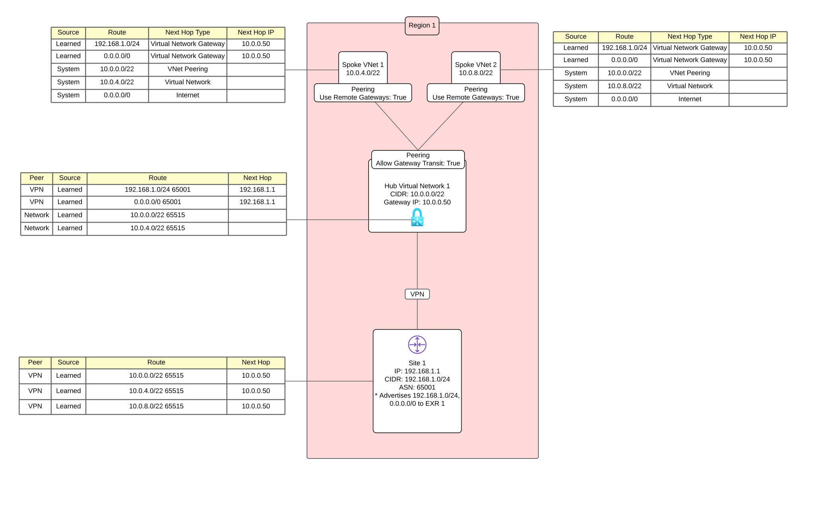

In this pattern there is a dedicated virtual network used for on-premises connectivity which is shared with each workload that each have their own dedicated virtual network and there is a requirement to send Internet-bound traffic back on-premises for inspection, mediation, and/or logging.

This is a common pattern for organizations new to Azure that may have a significant capital investment in security appliances on-premises that are not yet fully depreciated and are comfortable mediating network traffic between workloads using network security groups.

*Benefits*
* Site-to-Site VPN is [limited to maximum 2.3Gbps](https://learn.microsoft.com/en-us/azure/vpn-gateway/about-gateway-skus#performance) per tunnel which can be prohibitive when moving large amounts of data.
* All resources are forced to route Internet-bound traffic back on-premises where it can be mediated, inspected, and/or logged.
* Workloads have dedicated subscriptions containing their virtual network and workload resources creating separate blast radiuses.
* The on-premises connectivity resources are in a dedicated subscription creating a separate blast radius.
* Workloads can communicate each other by using the VPN Gateway as a transitive router.
* On-premises connectivity is provided by a VPN Gateway and routes are exchanged between Azure and on-premises with BGP.
* On-premises connectivity for the peered virtual network is provided by [gateway transit](https://learn.microsoft.com/en-us/azure/virtual-network/virtual-network-peering-overview).
* Virtual machine communication between subnets in the separate peered virtual networks can be mediated with network security groups.
* All virtual machines in the same virtual network can communicate with each other using default system routes.
* Virtual machine communication between subnets in the same virtual network can be mediated with network security groups.

*Considerations*
* This pattern creates a flat network where only network security groups can be used to mediate traffic between workloads.
* Additional costs and latency will be incurred for egressing Internet-bound traffic back on-premises.

### Hub And Spoke With A Flat Network And Forced Tunneling ExpressRoute
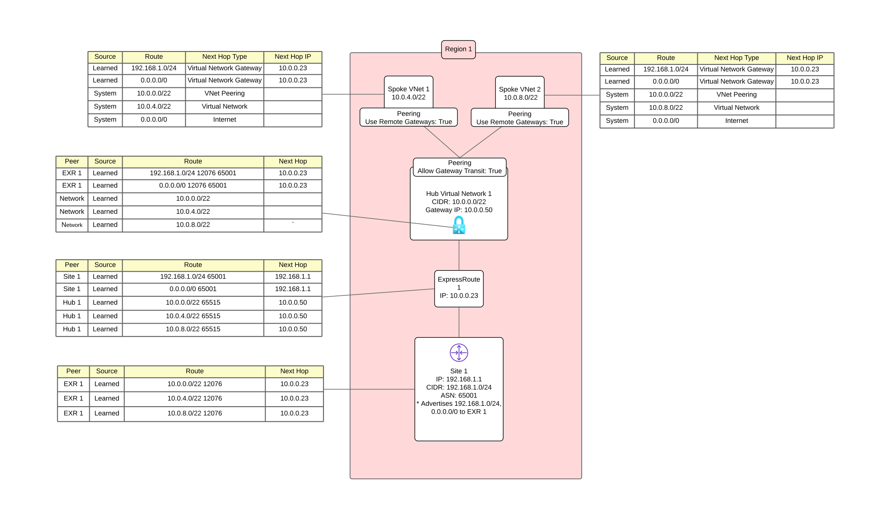

In this pattern there is a dedicated virtual network used for on-premises connectivity which is shared between workloads. Each workload has its own dedicated virtual network. Traffic between spokes is routed by the MSEE (Microsoft Edge Routers) which is referred to as "hair-pinning". Traffic destined to the Internet or on-premises is force tunneled back on-premises.

This is a pattern some customers new to Azure use for proof-of-concepts where latency between workload spokes is not an issue.

*Benefits*
* All resources are forced to route Internet-bound traffic back on-premises where it can be mediated, inspected, and/or logged.
* Workloads have dedicated subscriptions containing their virtual network and workload resources creating separate blast radiuses.
* The on-premises connectivity resources are in a dedicated subscription creating a separate blast radius.
* Workloads can communicate each other by using the MSEE (Microsoft Enterprise Edge) routers.
* On-premises connectivity is provided by a ExpressRoute connection and routes are exchanged between Azure and on-premises with BGP.
* On-premises connectivity for the peered virtual network is provided by [gateway transit](https://learn.microsoft.com/en-us/azure/virtual-network/virtual-network-peering-overview).
* Virtual machine communication between subnets in the separate peered virtual networks can be mediated with network security groups.
* All virtual machines in the same virtual network can communicate with each other using default system routes.
* Virtual machine communication between subnets in the same virtual network can be mediated with network security groups.

*Considerations*
* "Hair-pinning" traffic across the MSEE routers can result in throttling and highly variable latency. I do not recommend you use this pattern for production workloads.
* This pattern creates a flat network where only network security groups can be used to mediate traffic between workloads.
* Additional costs and latency will be incurred for egressing Internet-bound traffic back on-premises.

### Hub And Spoke With East and West Firewall And Forced Tunneling
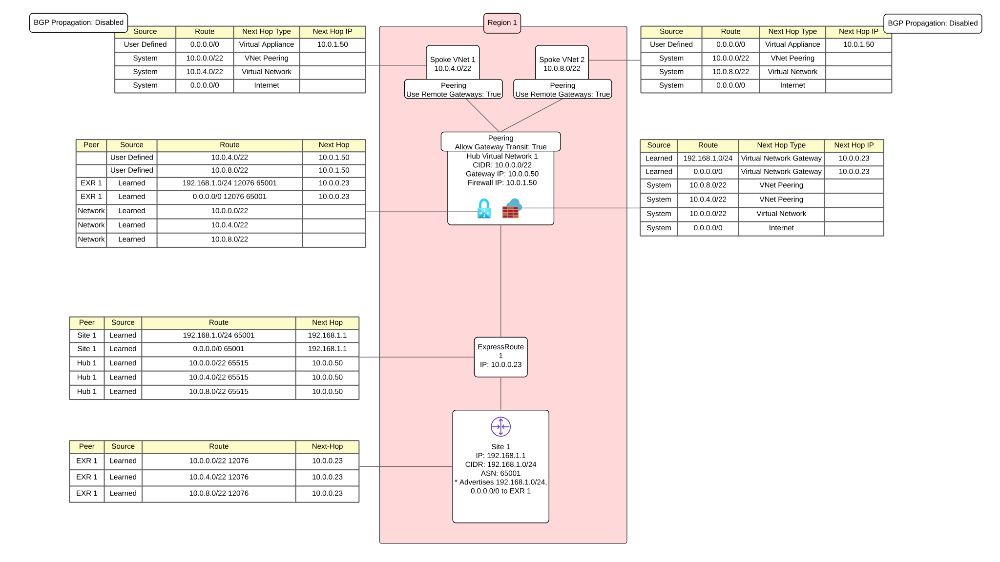

In this pattern there is a dedicated virtual network used for on-premises connectivity which is shared with each workload that each have their own dedicated virtual network and there is a requirement to send Internet-bound traffic back on-premises for inspection, mediation, filtering, and/or logging. There is also a requirement for inspection, mediation, and/or logging for traffic between on-premises and workloads and for traffic between workloads but these activities must be performed by a firewall in Azure.

This pattern also uses a dedicated virtual network in a dedicated subscription for shared infrastructure services. These services can include Microsoft Active Directory, patching or update services, or logging services.

This is a common pattern for organizations new to Azure that may have a significant capital investment in security appliances on-premises that are not yet fully depreciated but want mediation, inspection, and/or centralized logging between workloads which is provided by a firewall in Azure.

*Benefits*
* The firewall in Azure receives all traffic from workloads destined for on-premises, other workloads, or the Internet and can be used to centrally mediate, inspect, and/or log traffic.
* All Internet-bound traffic is forced to route back on-premises where it can be mediated, inspected, and/or logged.
* Shared infrastructure services added to Azure reduce the for workloads to go back on-premises for these services reducing network costs, latency, and mitigate impact of lost connectivity to on-premises.
* Shared infrastructure services have a dedicated subscription containing its own virtual network and resources creating a separate blast radius.
* Workloads have dedicated subscriptions containing their virtual network and workload resources creating separate blast radiuses.
* The on-premises connectivity and network security appliances resources are in a dedicated subscription creating a separate blast radius.
* All virtual machines in the separate peered virtual networks can communicate with each other by using the firewall for transitive routing.
* On-premises connectivity is provided by a ExpressRoute connection and routes are exchanged between Azure and on-premises with BGP.
* Virtual machine communication between subnets in the separate peered virtual networks can be mediated with network security groups.
* All virtual machines in the same virtual network can communicate with each other using default system routes.
* Virtual machine communication between subnets in the same virtual network can be mediated with network security groups.

*Considerations*
* Additional costs of the firewall running in Azure.
* Additional costs and latency will be incurred for egressing Internet-bound traffic back on-premises.

### Hub And Spoke With Single Firewall For North South East West
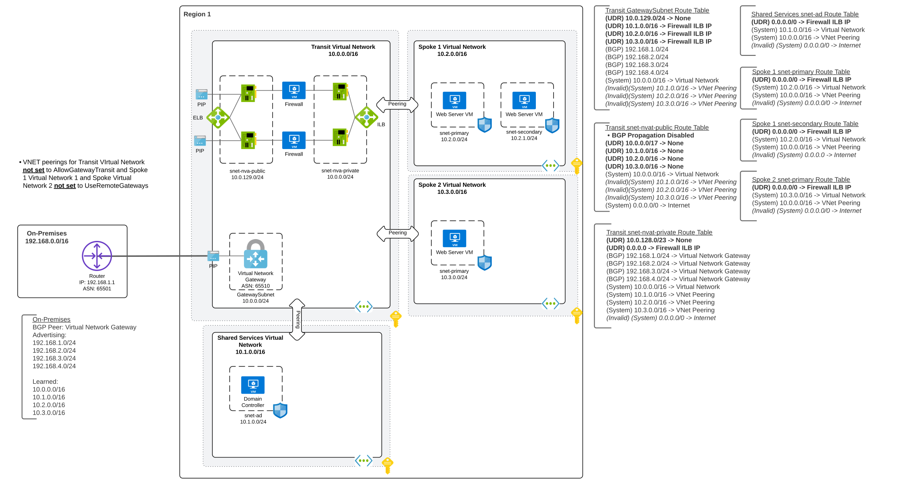

In this pattern there is a dedicated virtual network used for on-premises connectivity which is shared with each workload that each have their own dedicated virtual network. There is requirement for Internet-bound traffic, traffic between on-premises and Azure, and traffic between workloads in Azure to be mediated, inspected, and/or centrally logged by firewalls in Azure.

This pattern also uses a dedicated virtual network in a dedicated subscription for shared infrastructure services. These services can include Microsoft Active Directory, patching or update services, or logging services.

This is one of the more common patterns for organizations using Azure.

*Benefits*
* The firewall in Azure receives all traffic from workloads destined for on-premises, other workloads, or the Internet and can be used to centrally mediate, inspect, and/or log traffic.
* All Internet-bound traffic is egressed directly out of Azure reducing networking complexity.
* Shared infrastructure services added to Azure reduce the for workloads to go back on-premises for these services reducing network costs, latency, and mitigate impact of lost connectivity to on-premises.
* Shared infrastructure services have a dedicated subscription containing its own virtual network and resources creating a separate blast radius.
* Workloads have dedicated subscriptions containing their virtual network and workload resources creating separate blast radiuses.
* The on-premises connectivity and network security appliances resources are in a dedicated subscription creating a separate blast radius.
* All virtual machines in the separate peered virtual networks can communicate with each other by using the firewall for transitive routing.
* On-premises connectivity is provided by a ExpressRoute connection and routes are exchanged between Azure and on-premises with BGP.
* Virtual machine communication between subnets in the separate peered virtual networks can be mediated with network security groups.
* All virtual machines in the same virtual network can communicate with each other using default system routes.
* Virtual machine communication between subnets in the same virtual network can be mediated with network security groups.

*Considerations*
* All north/south/east/west traffic flows through a single set of firewalls which could create a bottleneck.
* Additional costs of the firewall running in Azure.

### Hub And Spoke With Dedicated North And South Firewall And Dedicated East And West Firewall
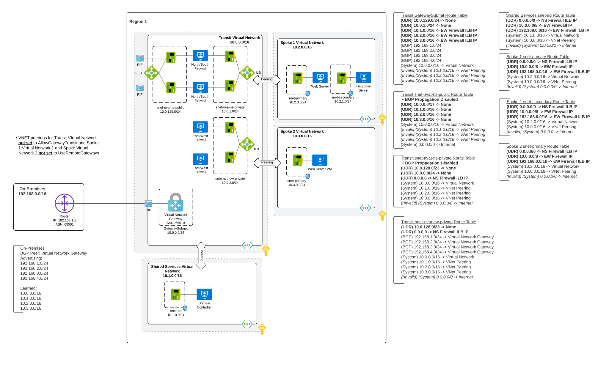

In this pattern there is a dedicated virtual network used for on-premises and Internet connectivity which is shared with each workload that each have their own dedicated virtual network. There is requirement for Internet-bound traffic, traffic between on-premises and Azure, and traffic between workloads in Azure to be mediated, inspected, and/or centrally logged by firewalls in Azure. There is a separate firewall stack for north/south traffic and another for east/west traffic.

This pattern also uses a dedicated virtual network in a dedicated subscription for shared infrastructure services. These services can include Microsoft Active Directory, patching or update services, or logging services.

This is one of the more common patterns for organizations using Azure that have a significant amount of internal and externallly facing workloads and would like to mitigate the risk of a bottleneck.

*Benefits*
* North/south and east/west traffic is distributed to two separate firewall stacks reducing the risk of a bottleneck.
* Traffic between the north/south public subnet and private subnet interfaces is blackholed creating a DMZ-like configuration.
* Traffic between the north/south public and private interfaces is blackholed to create a DMZ-like configuration.
* All Internet-bound traffic is egressed directly out of Azure reducing networking complexity.
* Shared infrastructure services added to Azure reduce the for workloads to go back on-premises for these services reducing network costs, latency, and mitigate impact of lost connectivity to on-premises.
* Shared infrastructure services have a dedicated subscription containing its own virtual network and resources creating a separate blast radius.
* Workloads have dedicated subscriptions containing their virtual network and workload resources creating separate blast radiuses.
* The on-premises connectivity and network security appliances resources are in a dedicated subscription creating a separate blast radius.
* All virtual machines in the separate peered virtual networks can communicate with each other by using the firewall for transitive routing.
* On-premises connectivity is provided by a ExpressRoute connection and routes are exchanged between Azure and on-premises with BGP.
* Virtual machine communication between subnets in the separate peered virtual networks can be mediated with network security groups.
* All virtual machines in the same virtual network can communicate with each other using default system routes.
* Virtual machine communication between subnets in the same virtual network can be mediated with network security groups.

*Considerations*
* Carving out IP address blocks for Azure must be well planned to avoid frequent changes to static routes.
* Routing can become complex.
* Additional costs of running multiple sets of firewalls.

### Multiple Region Hub And Spoke With Forced Tunneling And No Firewall
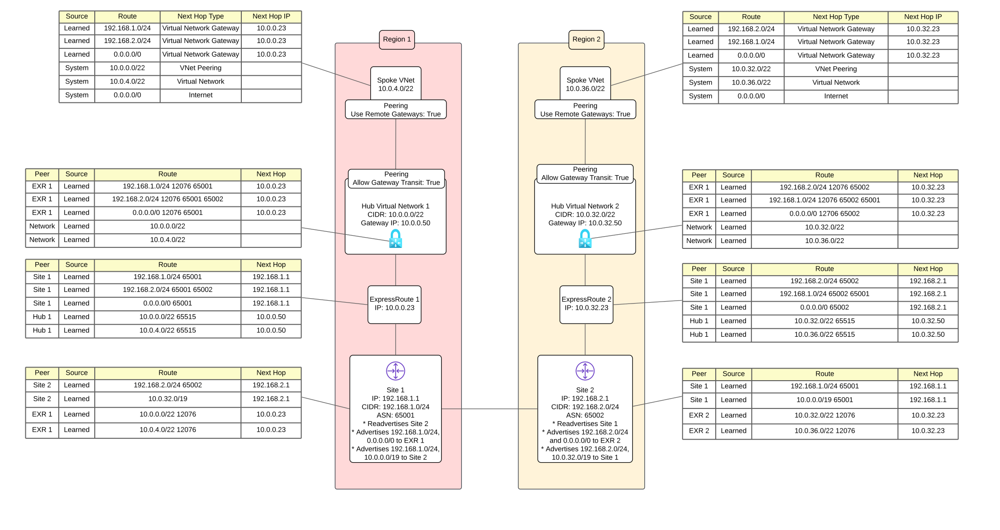

In this pattern there is a hub virtual network in each region withan ExpressRoute Gateway. Hub virtual networks are not peered and an ExpressRoute bowtie has not been setup. Traffic between Azure regions routes back on-premises and is routed between ExpressRoute circuits by the customer's on-premises routing infrastructure.

This is not a recommended pattern.

*Benefits*
* Spoke virtual networks in different Azure regions can communicate with each other.
* All resources are forced to route Internet-bound traffic back on-premises where it can be mediated, inspected, and/or logged.
* Workloads have dedicated subscriptions containing their virtual network and workload resources creating separate blast radiuses.
* The on-premises connectivity resources are in a dedicated subscription creating a separate blast radius.
* Workloads can communicate each other by using the MSEE (Microsoft Enterprise Edge) routers.
* On-premises connectivity is provided by a ExpressRoute connection and routes are exchanged between Azure and on-premises with BGP.
* On-premises connectivity for the peered virtual network is provided by [gateway transit](https://learn.microsoft.com/en-us/azure/virtual-network/virtual-network-peering-overview).
* Virtual machine communication between subnets in the separate peered virtual networks can be mediated with network security groups.
* All virtual machines in the same virtual network can communicate with each other using default system routes.
* Virtual machine communication between subnets in the same virtual network can be mediated with network security groups.

*Considerations*
* Considerable dependency on on-premises routing infrastructure.
* Additional costs and latency will be incurred for egressing Internet-bound and inter-region traffic back on-premises.

### Multiple Region Hub And Spoke With Forced Tunneling And No Firewall With ExpressRoute Bowtie
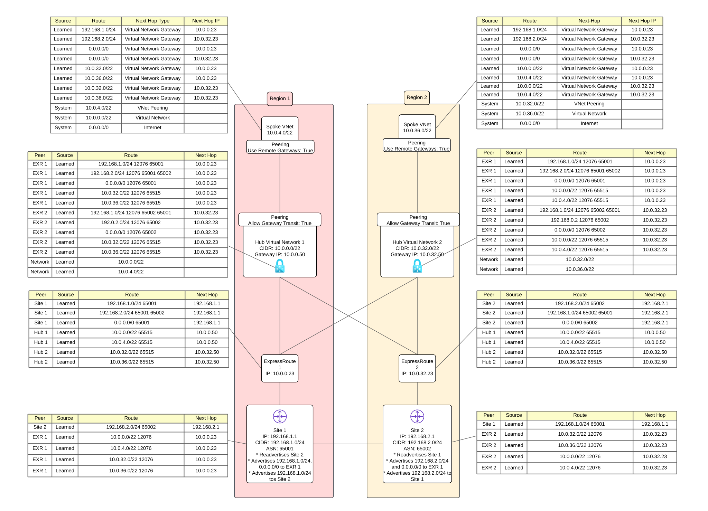

In this pattern there is a hub virtual network in each region withan ExpressRoute Gateway. Hub virtual networks are not peered. An ExpressRoute bowtie has been setup. Traffic between Azure regions routes across MSEEs to provide intra-region and inter-region routing.

This pattern may be used for proof-of-concepts where latency between workloads within the same region or in different regions is not an issue.

*Benefits*
* Workloads in different Azure regions can communicate with each other by using the MSEE (Microsoft Enterprise Edge) routers.
* All resources are forced to route Internet-bound traffic back on-premises where it can be mediated, inspected, and/or logged.
* Workloads have dedicated subscriptions containing their virtual network and workload resources creating separate blast radiuses.
* The on-premises connectivity resources are in a dedicated subscription creating a separate blast radius.
* Workloads in the same region can communicate each other by using the MSEE (Microsoft Enterprise Edge) routers.
* On-premises connectivity is provided by a ExpressRoute connection and routes are exchanged between Azure and on-premises with BGP.
* On-premises connectivity for the peered virtual network is provided by [gateway transit](https://learn.microsoft.com/en-us/azure/virtual-network/virtual-network-peering-overview).
* Virtual machine communication between subnets in the separate peered virtual networks can be mediated with network security groups.
* All virtual machines in the same virtual network can communicate with each other using default system routes.
* Virtual machine communication between subnets in the same virtual network can be mediated with network security groups.

*Considerations*
* "Hair-pinning" traffic across the MSEE routers can result in throttling and highly variable latency. I do not recommend you use this pattern for production workloads.
* Considerable dependency on on-premises routing infrastructure.
* Additional costs and latency will be incurred for egressing Internet-bound and inter-region traffic back on-premises.

### Multiple Region Hub And Spoke With Forced Tunneling and East West Firewall And No Global Peering
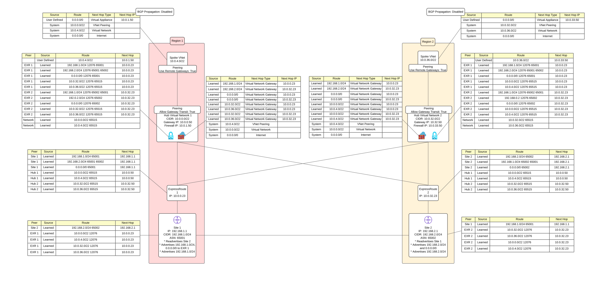

In this pattern there is a hub virtual network in each region withan ExpressRoute Gateway. Hub virtual networks are not peered. An ExpressRoute bowtie has been setup. Global peering between hub virtual networks has not been setup. Traffic between Azure regions routes across MSEEs to provide intra-region and inter-region routing.

This pattern may be used in an attempt to save on peering costs. I do not recommended this pattern for production workloads.

*Benefits*
* Workloads in different Azure regions can communicate with each other by using the MSEE (Microsoft Enterprise Edge) routers.
* All resources are forced to route Internet-bound traffic back on-premises where it can be mediated, inspected, and/or logged.
* Workloads have dedicated subscriptions containing their virtual network and workload resources creating separate blast radiuses.
* The on-premises connectivity resources are in a dedicated subscription creating a separate blast radius.
* Workloads in the same region can communicate each using the firewall for transitive routing.
* Traffic between workloads in the same region can be inspected by the firewall in Azure.
* On-premises connectivity is provided by a ExpressRoute connection and routes are exchanged between Azure and on-premises with BGP.
* On-premises connectivity for the peered virtual network is provided by [gateway transit](https://learn.microsoft.com/en-us/azure/virtual-network/virtual-network-peering-overview).
* Virtual machine communication between subnets in the separate peered virtual networks can be mediated with network security groups.
* All virtual machines in the same virtual network can communicate with each other using default system routes.
* Virtual machine communication between subnets in the same virtual network can be mediated with network security groups.

*Considerations*
* "Hair-pinning" traffic across the MSEE routers can result in throttling and highly variable latency. I do not recommend you use this pattern for production workloads.
* Considerable dependency on on-premises routing infrastructure.
* Additional costs and latency will be incurred for egressing Internet-bound and inter-region traffic back on-premises.

### Multiple Region Hub And Spoke With Forced Tunneling and East West Firewall And With Global Peering
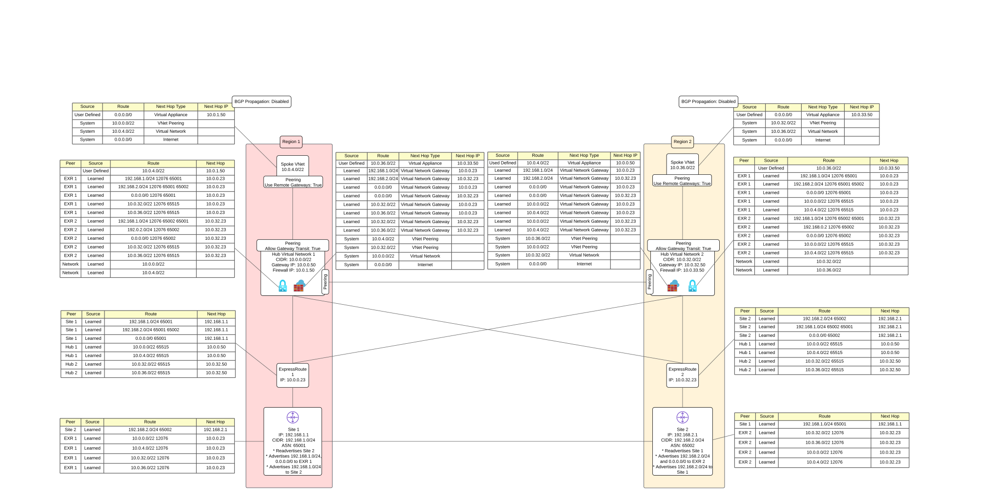

In this pattern there is a hub virtual network in each region withan ExpressRoute Gateway. An ExpressRoute bowtie has been setup. Global peering between hub virtual networks has been configured. Traffic between Azure regions routes across the global peering.

This is a common pattern for organizations new to Azure that may have a significant capital investment in security appliances on-premises that are not yet fully depreciated and need to be used for mediation, inspection, and logging of Internet-bound traffic. Traffic between workloads running in Azure are mediated, inspected, and centrally logged by a firewall in Azure.

*Benefits*
* Workloads in different Azure regions can communicate over the low-latency global virtual network peering.
* All resources are forced to route Internet-bound traffic back on-premises where it can be mediated, inspected, and/or logged.
* Workloads have dedicated subscriptions containing their virtual network and workload resources creating separate blast radiuses.
* The on-premises connectivity resources are in a dedicated subscription creating a separate blast radius.
* Workloads in the same region can communicate each using the firewall for transitive routing.
* Traffic between workloads in the same region can be inspected by the firewall in Azure.
* On-premises connectivity is provided by a ExpressRoute connection and routes are exchanged between Azure and on-premises with BGP.
* On-premises connectivity for the peered virtual network is provided by [gateway transit](https://learn.microsoft.com/en-us/azure/virtual-network/virtual-network-peering-overview).
* Virtual machine communication between subnets in the separate peered virtual networks can be mediated with network security groups.
* All virtual machines in the same virtual network can communicate with each other using default system routes.
* Virtual machine communication between subnets in the same virtual network can be mediated with network security groups.

*Considerations*
* Additional costs and latency will be incurred for egressing Internet-bound and inter-region traffic back on-premises.

### Multiple Region Hub And Spoke With North South East West Firewall And With Global Peering
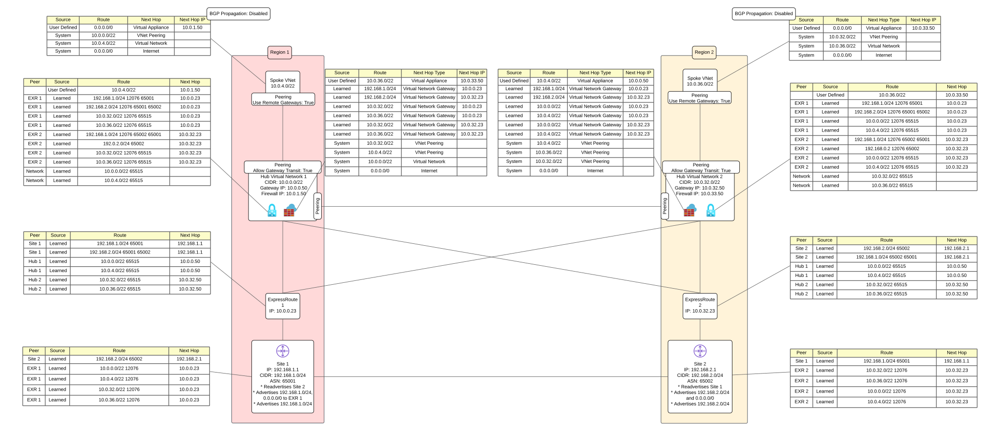

In this pattern there is a hub virtual network in each region withan ExpressRoute Gateway. An ExpressRoute bowtie has been setup. Global peering between hub virtual networks has been configured. Traffic between Azure regions routes across the global peering.

This is a common pattern for organizations both new and mature in Azure. Internet-bound traffic, traffic between workloads within the same region and different regions, and traffic exchanged with on-premises can be centrally mediated, inspected, and logged using the firewalls in Azure.

*Benefits*
* Workloads in different Azure regions can communicate over the low-latency global virtual network peering.
* All resources are forced to route Internet-bound traffic back on-premises where it can be mediated, inspected, and/or logged.
* Workloads have dedicated subscriptions containing their virtual network and workload resources creating separate blast radiuses.
* The on-premises connectivity resources are in a dedicated subscription creating a separate blast radius.
* Workloads in the same region can communicate each using the firewall for transitive routing.
* Traffic between workloads in the same region can be inspected by the firewall in Azure.
* On-premises connectivity is provided by a ExpressRoute connection and routes are exchanged between Azure and on-premises with BGP.
* On-premises connectivity for the peered virtual network is provided by [gateway transit](https://learn.microsoft.com/en-us/azure/virtual-network/virtual-network-peering-overview).
* Virtual machine communication between subnets in the separate peered virtual networks can be mediated with network security groups.
* All virtual machines in the same virtual network can communicate with each other using default system routes.
* Virtual machine communication between subnets in the same virtual network can be mediated with network security groups.

*Considerations*
* Costs of traffic flowing over global virtual network peering
* Additional costs of the firewall running in Azure.

### VWAN - Single Region VWAN Hub
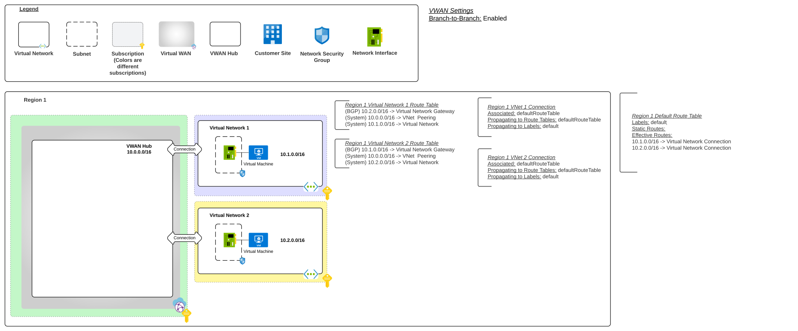

In this pattern there is a VWAN with a hub in a single region with connections to two virtual networks. 

*Benefits*
* Intra-hub virtual networks can communicate with each other by default.

*Considerations*
* All resources in Azure have direct access to the Internet through the default system route.
* Mediation between intra-hub virtual networks is done with Network Security Groups.

### VWAN - Single Region VWAN Hub With Single Branch
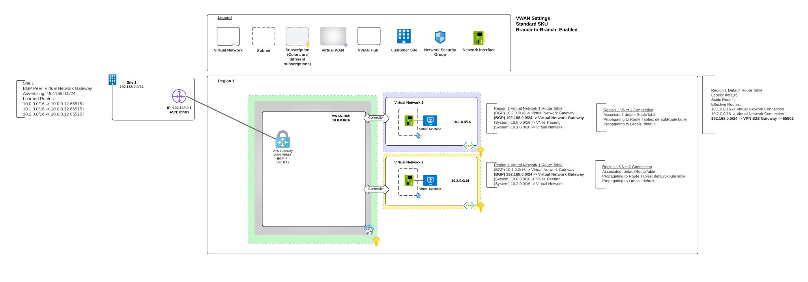

In this pattern there is a VWAN with a hub in a single region with connections to two virtual networks. A single branch site is connected to the hub.

*Benefits*
* Intra-hub virtual networks can communicate with each other by default.
* Branch sites can communicate with intra-hub virtual networks by default.

*Considerations*
* All resources in Azure have direct access to the Internet through the default system route.
* Mediation between intra-hub virtual networks is done with Network Security Groups.
* Mediation between branch sites and virtual networks is done with Network Security Groups and optional on-premises security appliances.

### VWAN - Single Region VWAN Hub With Multiple Branches
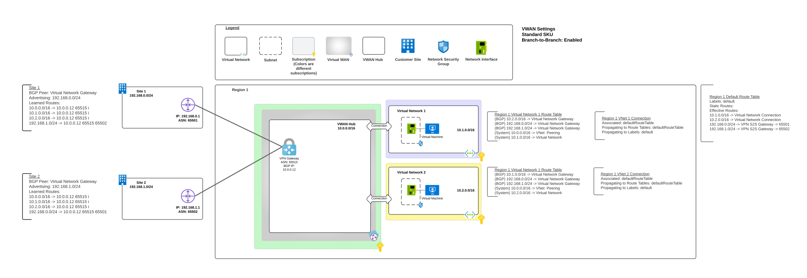

In this pattern there is a VWAN with a hub in a single region with connections to two virtual networks. Multiple branch sites are connected to the hub.

*Benefits*
* Intra-hub virtual networks can communicate with each other by default.
* Branch sites can communicate with intra-hub virtual networks by default.
* Branch sites can communicate with other branch sites by default.

*Considerations*
* All resources in Azure have direct access to the Internet through the default system route.
* Mediation between intra-hub virtual networks is done with Network Security Groups.
* Mediation between branch sites and virtual networks is done with Network Security Groups and optional on-premises security appliances.
* Mediation between branch sites is done with on-premises firewalls.

### VWAN - Multiple Region VWAN Hubs With Multiple Branches Connected to a Single Hub
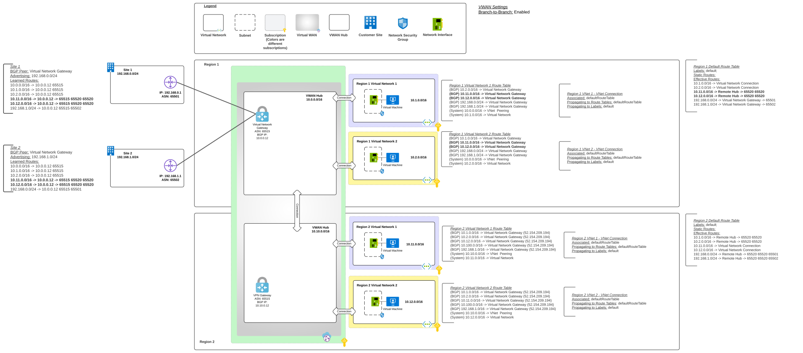

In this pattern there are multiple VWAN Hubs in separate regions. Each hub is connected to multiple virtual networks within the region.

Branch sites are connected to a hub in a single region to allow connectivity to the virtual networks in both regions using the VWAN cross hub connectivity.

*Benefits*
* Intra-hub virtual networks can communicate with each other by default.
* Inter-hub virtual networks can communicate with each other by default.
* Branch sites can communicate with intra-hub virtual networks by default.
* Branch sites can communicate with other branch sites by default.
* Branch sites can comunicate with inter-hub virtual networks by default.

*Considerations*
* All resources in Azure have direct access to the Internet through the default system route.
* Mediation between intra-hub and inter-hub virtual networks is done with Network Security Groups.
* Mediation between branch sites and virtual networks both intra-hub and inter-hub is done with Network Security Groups and optional on-premises security appliances.
* Mediation between branch sites is done with on-premises firewalls.
* Loss of connectivity from the branch sites to the hub the site is connected to results in loss of connectivity to Azure.

### VWAN - Multiple Region VWAN Hubs With Multiple Branches Connected to Multiple Hubs
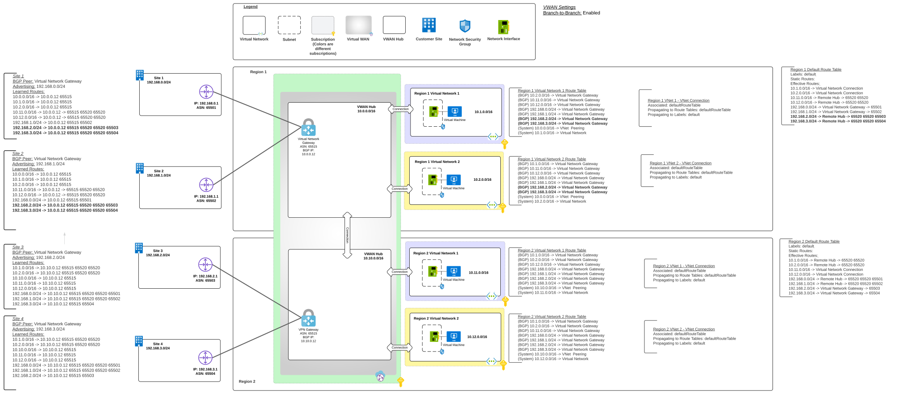

This is an appropriate pattern for organizations that want any-to-any connectivity out of the box. It allows for connectivity between branches and virtual networks, including across regions.

It is not appropriate for organizations that require centralized mediation and/or inspection using an NVA (network virtual appliance).

*Benefits*
* Intra-hub virtual networks can communicate with each other by default.
* Inter-hub virtual networks can communicate with each other by default.
* Branch sites can communicate with intra-hub virtual networks by default.
* Branch sites can communicate with other branch sites by default both intra-hub and inter-hub.
* Branch sites can comunicate with inter-hub virtual networks by default.

*Considerations*
* All resources in Azure have direct access to the Internet through the default system route.
* Mediation between intra-hub and inter-hub virtual networks is done with Network Security Groups.
* Mediation between branch sites and virtual networks both intra-hub and inter-hub is done with Network Security Groups and optional on-premises security appliances.
* Mediation between branch sites is done with on-premises firewalls.
* Loss of connectivity from the branch sites to the hub the site is connected to results in loss of connectivity to Azure.

### VWAN - Multiple Region VWAN Hubs With Multiple Branches Connected to Multiple Hubs For Redundancy
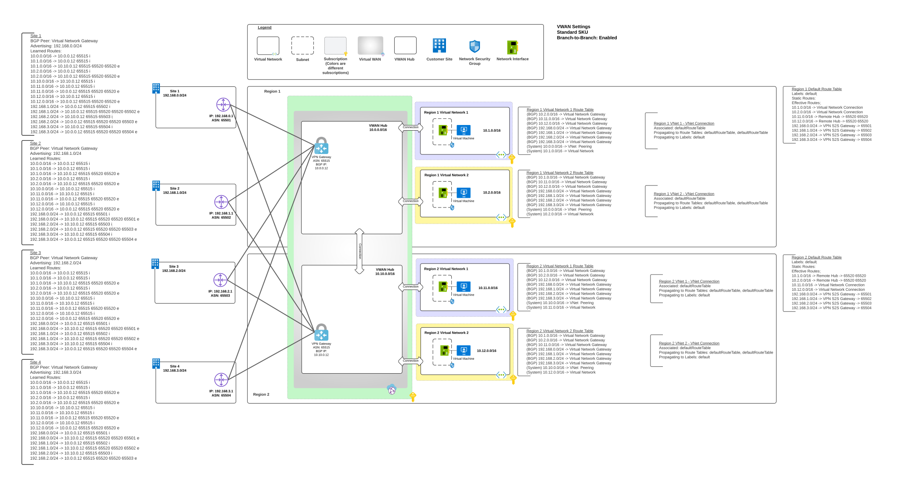

This is an appropriate pattern for organizations that want any-to-any connectivity out of the box. It allows for connectivity between branches and virtual networks, including across regions. Branch sites also have redundancy to their connectivity in Azure in the instance an Azure region were to become unavailable.

It is not appropriate for organizations that require centralized mediation and/or inspection using an NVA (network virtual appliance).

*Benefits*
* Intra-hub virtual networks can communicate with each other by default.
* Inter-hub virtual networks can communicate with each other by default.
* Branch sites can communicate with intra-hub virtual networks by default.
* Branch sites can communicate with other branch sites by default both intra-hub and inter-hub.
* Branch sites can comunicate with inter-hub virtual networks by default.
* Local preferences can be applied to routes advertised from VWAN Hub to branch sites to prefer a specific connection.
* If connectivity from a branch site to a hub is lost, connectivity to Azure will still be possible using the connection to the other hub.

*Considerations*
* All resources in Azure have direct access to the Internet through the default system route.
* Mediation between intra-hub and inter-hub virtual networks is done with Network Security Groups.
* Mediation between branch sites and virtual networks both intra-hub and inter-hub is done with Network Security Groups and optional on-premises security appliances.
* Mediation between branch sites is done with on-premises firewalls.

### VWAN - Multiple Region VWAN Secure Hubs with Multiple Branches Connected to Multiple Hubs for Redundancy and North and South Firewall Using Routing Intent
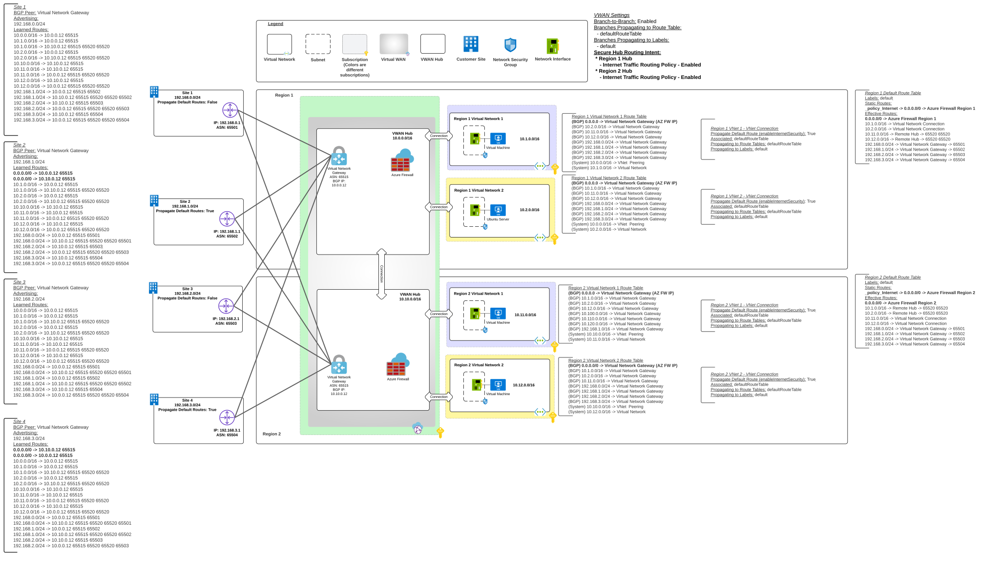

The author recommends this pattern for regulated customers using Azure Virtual WAN who have requirements to mediate and inspect north and south traffic. In this pattern, north and south traffic is automatically routed through Azure Firewall or a [compatible NVA (network virtual appliance)](https://docs.microsoft.com/en-us/azure/virtual-wan/about-nva-hub) that is deployed into each VWAN hub using the [Secure Hub feature](https://docs.microsoft.com/en-us/azure/firewall-manager/secured-virtual-hub). Traffic can be centrally mediated and/or inspected.

*Benefits*
* Intra-hub virtual networks can communicate with each other by default.
* Inter-hub virtual networks can communicate with each other by default.
* Branch sites can communicate with intra-hub virtual networks by default.
* Branch sites can communicate with other branch sites by default both intra-hub and inter-hub.
* Branch sites can comunicate with inter-hub virtual networks by default.
* Local preferences can be applied to routes advertised from VWAN Hub to branch sites to prefer a specific connection.
* If connectivity from a branch site to a hub is lost, connectivity to Azure will still be possible using the connection to the other hub.
* Traffic to the Internet from the attached virtual networks (and optionally sites) is routed through a supported appliance in the hub for mediation and/or inspection.

*Considerations*
* Requires a security appliance that is supported to run in a VWAN Secure Hub
* Mediation between intra-hub and inter-hub virtual networks is done with Network Security Groups.
* Mediation between branch sites and virtual networks both intra-hub and inter-hub is done with Network Security Groups and optional on-premises security appliances.
* Mediation between branch sites is done with on-premises firewalls.
* Static routes on default route tables are not supported.

### VWAN - Multiple Region VWAN Secure Hubs with Multiple Branches Connected to Multiple Hubs for Redundancy and North South East West Firewall Using Routing Intent
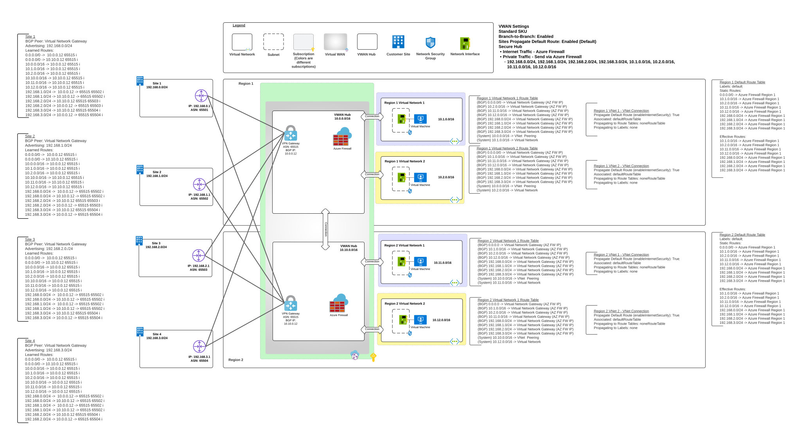

The author recommends this pattern for regulated customers using Azure Virtual WAN who have requirements to mediate and inspect north, south, east, and west traffic. In this pattern north, south, east, and west traffic is automatically routed through Azure Firewall or a [compatible NVA (network virtual appliance)](https://docs.microsoft.com/en-us/azure/virtual-wan/about-nva-hub) that is deployed into each VWAN hub using the [Secure Hub feature](https://docs.microsoft.com/en-us/azure/firewall-manager/secured-virtual-hub). 

*Benefits*
* Intra-hub virtual networks can communicate with each other by default.
* Branch sites can communicate with intra-hub virtual networks by default.
* Branch sites can communicate with other branch sites by default intra-hub..
* Local preferences can be applied to routes advertised from VWAN Hub to branch sites to prefer a specific connection.
* If connectivity from a branch site to a hub is lost, connectivity to the hub virtual networks the branch still has connection to will still be possible.
* Traffic to the Internet from the attached virtual networks (and optionally sites) is routed through a supported appliance in the hub for mediation and/or inspection.
* Traffic to and from the branch and virtual network intra-hub is routed through a supported appliance in the hub for mediation and/or inspection.
* Traffic between branch sites is routed through a supported security appliance in the hub for mediation and/or inspection.
* Traffic between virtual networks both within region and between regions is routed through a supported security appliance in the hub for mediation and/or inspection.

*Considerations*
* Requires a security appliance that is supported to run in a VWAN Secure Hub
* Static routes on default route tables are not supported.

### VWAN - Multiple Region VWAN Hubs With Multiple Branches Connected to Multiple Hubs For Redundancy and North and South Third Party Firewall

This is an appropriate pattern for organizations that only need north and south traffic inspection and mediation using a 3rd-party firewall that is not supported running in a VWAN Secure Hub. This IS NOT an appropriate pattern for customers who anticipate east and west traffic inspection and mediation requirements down the road.

This pattern is sometimes referred to as "firewall-on-a-stick"

*Benefits*
* Supports 3rd-party security appliances for north/south traffic inspection
* Intra-hub virtual networks can communicate with each other by default.
* Inter-hub virtual networks can communicate with each other by default.
* Branch sites can communicate with intra-hub virtual networks by default.
* Branch sites can communicate with other branch sites by default both intra-hub and inter-hub.
* Branch sites can comunicate with inter-hub virtual networks by default.

*Considerations*
* Cannot support traffic east/west traffic inspection between virtual networks
* Traffic inspection between on-premises and Azure or vice versa must be performed by customer on-premises security appliance
* Loss of security virtual network in a region causes loss of Internet access for virtual networks in that region
* Mediation between intra-hub and inter-hub virtual networks is done with Network Security Groups.
* Mediation between branch sites and virtual networks both intra-hub and inter-hub is done with Network Security Groups and optional on-premises security appliances.

### VWAN - Multiple Region VWAN Hubs with Multiple Branches Connected to Multiple Hubs for Redundancy and North South East West Third Party Firewall

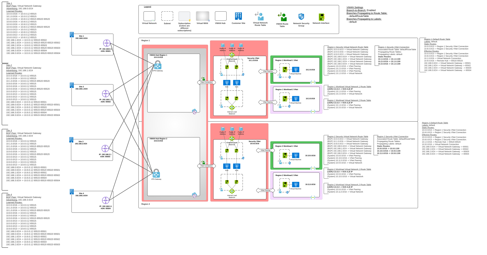

This pattern is sometimes referred to as an [indirect spoke or indirect hub pattern](https://learn.microsoft.com/en-us/azure/virtual-wan/scenario-route-through-nva). It provides the customer the ability to centrally mediate and inspect north, south, east, and west traffic with a 3rd party firewall that is [not supported](https://learn.microsoft.com/en-us/azure/virtual-wan/about-nva-hub) running in a VWAN Secure Hub. 

*Benefits*
* Branch sites can communicate with other branch sites by default intra-hub.
* Local preferences can be applied to routes advertised from VWAN Hub to branch sites to prefer a specific connection.
* If connectivity from a branch site to a hub is lost, connectivity to the hub virtual networks the branch still has connection to will still be possible.
* Traffic to the Internet from the indirect spokes can be mediated and inspected by a 3rd party security appliance that is not supported to run in a VWAN Secure Hub.
* Traffic between indirect spokes both within the same region and in different regions can be mediated and inspected by a 3rd party security appliance that is not supported to run in a VWAN Secure Hub.
* Traffic to and from the branch and virtual network intra-hub can be mediated and inspected by a 3rd party security appliance that is not supported to run in a VWAN Secure Hub.

*Considerations*
* This is complex pattern that requires extensive knowledge of both general Azure networking and Azure VWAN.
* Maintaining the static routes on each connection can become operationally significant at scale. While the static route prefixes can be summarized when applied to the route tables, the connections do not allow for summarization.
